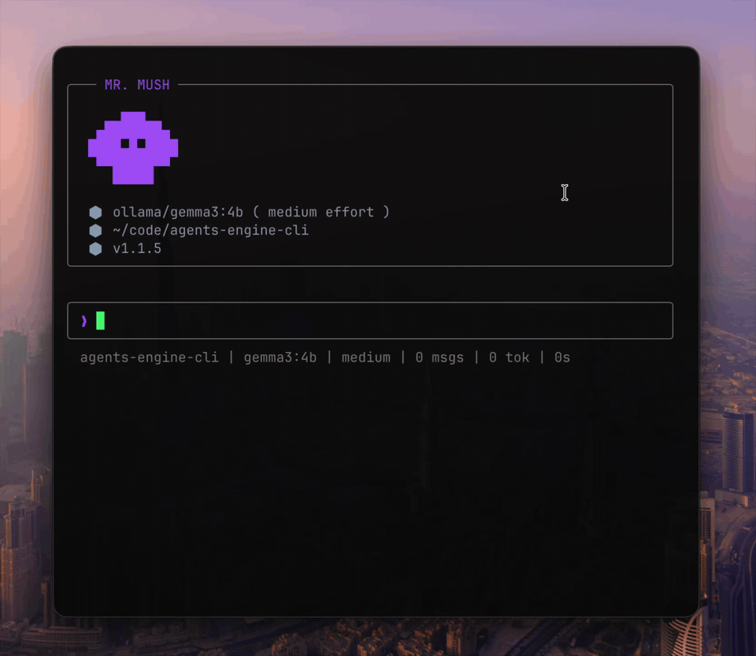

```text
      ▄▄███▄▄
    ▄███▀█▀███▄
    ▀█████████▀
       █████
        █ █
      ▀▀▀▀▀▀▀
```

# mush

Минималистичный локальный AI CLI с акцентом на TUI, стриминг, tool calling и контекстную инженерию.




## Что это

`mush` запускает локальных и удалённых моделей в одном интерфейсе:

- chat UI прямо в терминале
- стриминг ответов
- project prompts через `MRMUSH.md` и `AGENTS.md`
- bash tool calls с подтверждением
- история сессий и проектные approvals
- кастомные темы, статусбар и маркеры сообщений

## Запуск

```bash
npm install
node bin/mr-mush.js
```

Для глобального вызова:

```bash
npm link
mr-mush
```

## Конфиг

Глобальный конфиг:

```text
~/.mrmush/config.toml
```

Проектные файлы:

```text
.mrmush/config.toml
MRMUSH.md
AGENTS.md
```

Переменные окружения:

```text
MRMUSH_PROVIDER
MRMUSH_MODEL
MRMUSH_PROFILE
MRMUSH_THINKING
MRMUSH_LOCALE
```

## Возможности

- OpenAI, Anthropic, Gemini, Ollama и LM Studio
- потоковый вывод ответов вне CLI-режима
- project-level prompt stack: `MRMUSH.md`, `AGENTS.md`, project prompt files
- история диалогов и восстановление сессий
- approval flow для bash tool calls
- project-scoped approvals в `.mrmush/`
- настройка темы, маркера сообщения и статусбара
- мультстрочный input с историей и навигацией по тексту

## Команды

### Модель и режим

```text
/think off|minimal|low|medium|high|xhigh
/provider use ...
/model use ...
/profile use ...
```

### Интерфейс

```text
/dot <symbol>
/statusbar <prompt>
/card
```

### Промпты и конфиг

```text
/prompt show [system|profile|provider|project]
/prompt edit [system|profile|provider|project]
/prompt reset [system|profile|provider|project]
/config show
/config set <path> <value>
/config save
```

### История

```text
/resume
```

## Input и навигация

```text
Enter              отправить сообщение
Shift+Enter        перенос строки
← / →              движение по символам
Opt+← / Opt+→      движение по словам
Ctrl+← / Ctrl+→    движение по словам на Windows/Linux
Cmd+← / Cmd+→      начало / конец строки
Home / End         начало / конец строки на Windows/Linux
↑ / ↓              движение по строкам, а на границе — история
```

## Tool calling

`mush` умеет вызывать bash-команды от имени модели через approval flow. Allowlist настраивается в конфиге:

```toml
[tools.bash]
allowed_commands = ["pwd", "ls", "rg", "cat", "tree"]
allowed_git_subcommands = ["status", "diff", "log", "show"]
```

Если модель запросит команду вне allowlist, она будет заблокирована policy-слоем до выполнения.

## Разработка

Быстрая проверка:

```bash
node --check src/ui/scenes/chat.js
node --check src/ui/input.js
```
